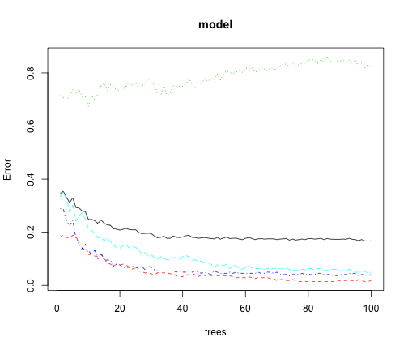
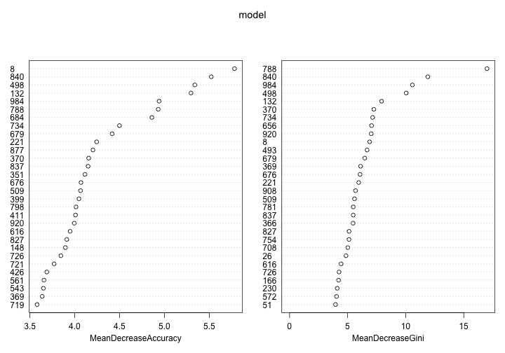

Run rf on a small sample of genom
========================================================

Run rf on a small small sample of genom (Categories are superpopulations)


```r
library(randomForest)
```

```
## randomForest 4.6-10
## Type rfNews() to see new features/changes/bug fixes.
```

```r
data <-read.table('wide-data.csv',header=FALSE, sep=",")

X <- t(data[-1,])
y <- as.factor(t(data[1,]))

model <-randomForest(X,y,ntree=100, importance=TRUE)
```

Plot OOB error rates


```r
plot(model)
```

 


```r
model$err.rate[90:100,]
```

```
##             OOB          0         1          2          3
##  [1,] 0.1732817 0.01811594 0.8430233 0.04072398 0.05494505
##  [2,] 0.1742498 0.01811594 0.8488372 0.04072398 0.05494505
##  [3,] 0.1732817 0.01811594 0.8430233 0.04072398 0.05494505
##  [4,] 0.1771539 0.01811594 0.8488372 0.04524887 0.06043956
##  [5,] 0.1732817 0.01811594 0.8372093 0.04524887 0.05494505
##  [6,] 0.1723136 0.01449275 0.8488372 0.04524887 0.04945055
##  [7,] 0.1684414 0.02173913 0.8255814 0.03619910 0.04945055
##  [8,] 0.1723136 0.01811594 0.8372093 0.04072398 0.05494505
##  [9,] 0.1674734 0.01449275 0.8197674 0.04072398 0.05219780
## [10,] 0.1665053 0.01449275 0.8313953 0.03619910 0.04670330
## [11,] 0.1674734 0.01811594 0.8197674 0.04072398 0.04945055
```


Plot variable importance


```r
varImpPlot(model)
```

 


